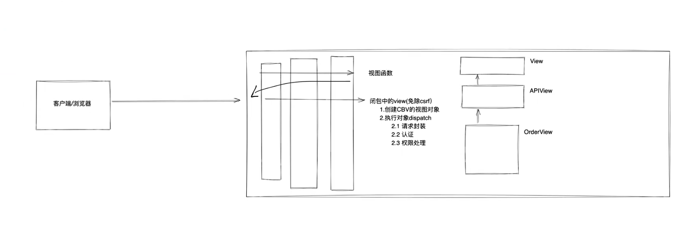

## request 对象
    - oop 相关
### 类中的 `__getattr__` 什么时候触发？
    - 对象中有的成员，不会触发
    - 对象中无的成员，会触发
```python
class Foo(object):
    def __init__(self, name, age):
        self.name = name
        self.age = age
    def show(self):
        return "xx"
    def __getattr__(self, item):
        print("--->", item)
        return 99
obj = Foo('Hpday', 24)
# 获取成员 方法1
# print(obj.name)
# print(obj.age)
# print(obj.show())
# 获取成员 方法2
# v1 = getattr(obj, 'name')
# print(v1)

# 不触发 __getattr__
obj.name
obj.age
obj.show()

# 触发 __getattr__
obj.xxx
```

### 类中的 `__getattribute__` 什么时候触发?
    - 只要执行 '对象.xxx' 都会执行 `__getattribute__`
    - object 中的 `__getattribute__` 内部处理机制
        - 对象中有值，返回
        - 对象中无值，报错
```python
class Foo(object):
    def __init__(self, name, age):
        self.name = name
        self.age = age
    def show(self):
        pass
        return "xx"

    # def __getattr__(self, item):
    #     print("--->", item)
    #     return 99

    def __getattribute__(self, item):
        print('--->', item)
        return 99
obj = Foo('Hpday', 24)
obj.name
obj.age
obj.show
```
### 案例分析
```python
class HttpResponse(object):
    def __init__(self):
        pass
    def v1(self):
        print('v1')
    def v2(self):
        print('v2')
class Request(object):
    def __init__(self, req, xx):
        self._request = req
        self.xx = xx
    def __getattr__(self, item):
        try:
            return getattr(self._request, item)
        except AttributeError:
            return self.__getattribute__(item)
            # return '你好'
req = HttpResponse()
req.v1()
req.v2()

request = Request(req, "Hpday")
request._request.v1()
request.v2()
print(request.v3)
```
    - drf 请求流程
    
    - 请求参数
        *, args**kwargs
        v1, v2, v3

## 认证组件
    - 直接用，用户授权
        示例1
        - 100 个 API，1个无需登录；其他需要登录
        - 实现
            - 编写类 -> 认证组件
            - 应用组件（局部）
        示例2
        - 100 个 API，1个无需登录；其他需要登录 （全局配置）
        - 实现
            - 编写类 -> 认证组件
            - 应用组件（全局）
            REST_FRAMEWORK= {
                "UNAUTHENTICATED_USER": None,
                "DEFAULT_AUTHENTICATION_CLASSES": ["app01_认证.views.MyAuthentication"]
            }
        在 drf 中，先从全局中找，再从局部中找
        全局配置时， 认证组件不能写在 views 视图中,会触发循环引用问题
    - 面向对象-继承
```python
class APIView(object):
    authentication_classes = 读取配置文件中的列表
    def dispatch(self):
        self.authentication_classes
class UserView(APIView):
    authentication_classes = ['xx']
obj = UserView()
obj.dispatch()
```
    - 认证源码分析
        -> 从 APIView 开始一步一步看（后续分析）
    - 知识点
        - 多个认证类
            - 都返回 None，都没有认证成功 -> 视图是否会被执行？ 视图函数会执行，只不过 self.user  self.auth = None
        - 状态码一致
            - 和 rest_framework 的 BaseAuthentication 
                def authenticate_header(self, request): 相关
    - 扩展，python 开发 -> 子类约束
```python
class C1(object):
    def fn1(self):
        raise NotImplementedError("fn1() must be overridden")
class C2(C1):
    def fn1(self):
        pass
```
## 案例：用户登录 + 用户认证
    POST http://127.0.0.1:8000/login/       用户名和密码  ->  JSON
    {
        "username": "Hpday",
        "password":"123"
    }
    {
        "status": true,
        "msg": "OK",
        "token": "9812cd1d-56da-45c8-9eda-ec973fc1c056"
    }
    GET http://127.0.0.1:8000/app01/user/?token=xx   请求头或URL 中携带 token
        - 请求头 GET   http://127.0.0.1:8000/app01/user/
                      Authorization: a5476a0d
                DRF 读取 "token = request.headers.get("Authorization")"
                        "token = request.META.get("HTTP_AUTHORIZATION")"
        - URL   GET http://127.0.0.1:8000/app01/user/?token=a5476a0d
                DRF 读取 "token = request.query_params.get("token")"

## 权限组件
    认证组件 = [认证类1, 认证类2, 认证类3, ... ]  -> 执行每个认证类中的 authenticate 方法
                                                    - 认证成功或失败，不会执行后续的认证类
                                                    - 返回None，执行后续的认证类
    
    项目中某个请求必须满足：A条件 && B条件 && C条件
    权限组件 = [权限类1, 权限类2, 权限类3, ... ]  -> 执行所有权限类的 has_permission 方法，返回 True 通过，返回 False 失败
                                                    - 执行所有的权限类
                                                    - 学会源码流程，扩展 + 自定义
    - 实现
        - 编写类 -> 认证组件
        - 应用组件（局部）
    应用场景： 经理角色、当前订单是他手下创建
    默认权限组件：必须满足[A条件、B条件、… ]
    
    整改：满足任意条件：A条件、B条件、C条件 … 
        - 覆写 check_permissions
        - 扩展 可以重写一个 NewView
            class NewView(APIView)
                def check_permissions(self, request):
                    pass
            在视图函数中继承 NewView, 而不继承 APIView
            class OrderView(NewView):
                pass
            这样可以复用
## 案例： 用户登录+用户认证+角色+扩展案例
    参考 AvatarView(NewView)
## 思考
    -开发过程中，发现drf中的request对象不好用，换成另外一个request实例对象，怎么换？
        dispatch -> initalize_request -> Request  覆写 initalize_request
    -drf中的认证、权限组件与django中的中间件有什么关系？



## 限流组件
    开发过程中，某个接口不希望用户访问过于频繁，限流机制，例如：平台显示1小时发送10次、IP限制、验证码、防止爬虫
    限制访问频率：
        -已登录用户，用户信息主键、ID、用户名
        -未登录，IP为唯一标识
    如何限制？ eg：10分钟3次
        "001": ["17:00","16:55","16:53"]
        1.获取当前访问时间 17:00
        2.当前时间-10分钟=计时开始时间 16:50
        3.删除小于16:50的时间
        4.计算当前记录的数组长度
            - 超过，报错
            - 未超过，可访问
    使用：
        -编写类
            1. 编写类
            2. 安装django-redis配置 -> settings.py
            3. 安装django-redis
            4. 启动redis服务
        -应用类
            5. 局部应用
    源码和具体实现：
        1.对象加载
            获取每个限流类的对象，初始化（读取限流的配置，获取到 时间间隔+访问次数） --> num_request, duration
            views.XXXView.as_view() -> rest_framework的as_view() -> django的as_view()
            找 dispatch -> rest_framework的dispatch() -> self.initial -> self.check_throttles(request)
        2.allow_request是否限流
    案例：用户登录 + 用户认证 + 角色 + 扩展案例 + 限流
        - 无需登录，限流 10/m 
        - 需要登陆，限流 5/m
        尝试一下把限流后的错误信息的格式美化，找到哪里抛出 raise —> 覆写
## day01任务
    1. 限流自定义错误提示
    2. 拆分知识点
        -getattr
        -getatrribute
        -继承
    3. request封装 + 认证 + 权限 + 限流 => 尽量梳理一份流程图

## day02 - drf 中篇
    上节内容：前后端分离概述、纯净项目、request对象、认证、权限、限流
    本节内容：
     1.版本：在请求中携带版本号，便于后续API的更新迭代
        -http://www.xxx.com/api/v1/info
        -http://www.xxx.com/api/v2/info
     2.解析器：读取不同格式的数据进行解析然后赋值给request.data等对象中
        user=Hpday&age=24
        {"user": "Hpday", "age": 24}
     3.序列化器：将ORM获取的QuerySet或数据对象序列化成JSON格式+请求格式校验
     4.分页：对ORM获取的的数据进行分页处理，分批发给用户
     5.视图：def中提供了APIView+其他视图类让我们来继承
## 版本
### 1.1 GET参数传递 - QueryParams
```python
REST_FRAMWORK = {
    "VERSION_PARAM": "xx",
    "DEFAULT_VERSION": "v1",
    "ALLOWED_VERSIONS": [ "v1", "v2", "v3" ],
    "DEFAULT_VERSIONING_CLASS": "rest_framework.versioning.QueryParameterVersioning"
}
```
源码执行流程从 dispatch -> rest_framework.initial -> rest_framework.determine_version ……

### 1.2 URL路径传递