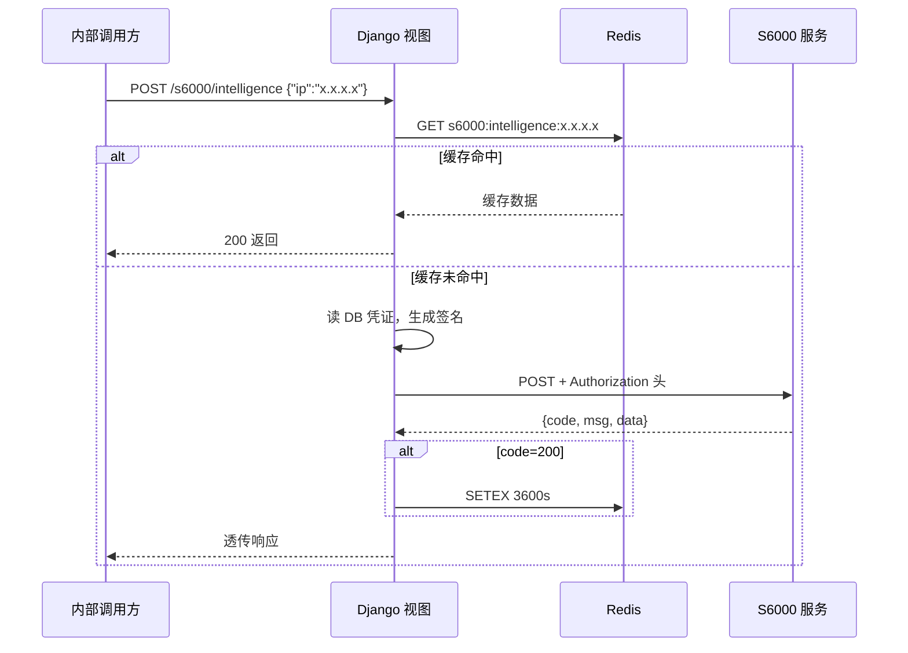

# S6000 接口代理层 — 设计文档

**日期**：2026-07-06
**方案**：基于现有 threatbook 模式的 Django app，封装 S6000 API

---

## 1. 背景

S6000 是一套外部 API 服务（国网情报），需要认证后调用。本模块在 Django 内封装一层代理，内部系统调用 Django 端点，由 Django 负责加签转发。

与现有 threatbook 模块架构一致。

---

## 2. 认证机制

来源：`Test.java` 示例代码。

```
timestamp = yyyyMMddHHmmssSSS 格式的毫秒时间戳
signature = hex(HmacSHA256(timestamp, secretKey))
Authorization = "Basic " + Base64(appCode + ":" + signature)
```

**关键点**：HmacSHA256 输入仅为 timestamp（不含 request body），输出是 hex 字符串（非 base64），拼入 Basic Auth 后再整体 base64。

---

## 3. 文件结构

```
s6000/
  __init__.py
  apps.py          # S6000AppConfig
  models.py        # S6000Config (key/value 存储凭证)
  signature.py     # 时间戳生成 + HMAC-SHA256 签名 + Authorization 拼装
  views.py         # intelligence 代理视图
  urls.py          # 路由注册
  migrations/
    __init__.py
```

---

## 4. Model 层

### S6000Config

| 字段 | 类型 | 说明 |
|---|---|---|
| key | CharField(100) unique | 配置键 |
| value | TextField | 配置值 |
| updated_at | DateTimeField auto_now | 更新时间 |

预置三条记录：

| key | 值 |
|---|---|
| `appCode` | `12_mtndata` |
| `secretKey` | `bbf0108f-e57a-4df8-8a6d-b94241a157b3` |
| `baseUrl` | `http://xxx.xxx.xxx.xxx:28088` |

---

## 5. 签名模块 — signature.py

三个纯函数，零 Django 依赖：

- `generate_timestamp()` — 返回 `yyyyMMddHHmmssSSS` 格式的当前毫秒时间戳
- `hmac_sha256_sign(data, secret_key)` — HmacSHA256 签名，返回 hex 字符串
- `build_authorization(app_code, secret_key, timestamp)` — 拼装完整的 Authorization header 值

`build_authorization` 内部先调用 `hmac_sha256_sign(timestamp, secret_key)` 得 signature，再拼接 `"Basic " + Base64(appCode + ":" + signature)`。

---

## 6. 视图层 — intelligence

**端点**：`POST /s6000/intelligence`
**入参**：`{"ip": "x.x.x.x"}` (String, 必填, IPv4)

### 处理流程

1. 校验 `ip` 是否存在 → 缺失返回 `400`
2. 查 Redis 缓存 `s6000:intelligence:{ip}` → 命中直接返回
3. 从 DB 读取 `S6000Config` 凭证 → 缺配置返回 `500`
4. 生成 `timestamp` + `Authorization`
5. `requests.post` 转发 S6000，携带 headers：
   - `Content-Type: application/json`
   - `Timestamp: {timestamp}`
   - `Authorization: {authorization}`
6. S6000 返回 `code=200` → 写入 Redis (TTL 3600s) → 返回结果
7. S6000 返回失败 → 不缓存 → 原样透传
8. 网络异常 (`requests.RequestException`) → 返回 `502`，msg 携带错误信息

### 响应格式

直接透传 S6000 原始响应 JSON，不额外包装：

```json
{"success": true, "code": 200, "msg": "success", "data": [...]}
{"success": false, "code": 500, "msg": "失败信息", "data": null}
```

### 调用时序



---

## 7. 路由

```python
# s6000/urls.py
urlpatterns = [
    path('s6000/intelligence', views.intelligence, name='intelligence'),
]

# DRF/urls.py 新增
path('', include('s6000.urls', namespace='s6000')),
```

---

## 8. 缓存

| 配置 | 值 |
|---|---|
| Redis 连接 | `redis://:Hpday@8.136.200.128:6379/1` (复用现有) |
| Key 格式 | `s6000:intelligence:{ip}` |
| TTL | 3600s |
| 序列化 | JSON string |

---

## 9. 注册项

- `DRF/settings.py` → `INSTALLED_APPS` 追加 `'s6000'`
- `DRF/urls.py` → `urlpatterns` 追加路由

---

## 10. 不纳入第一版

- DB 缓存层（threatbook 的 DB 缓存是注释掉的，不照搬）
- 通用透传网关（等接口超过 3 个再评估）
- Celery 异步调用
- 请求日志
